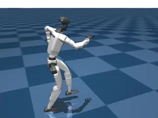
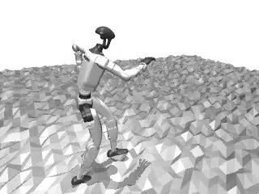
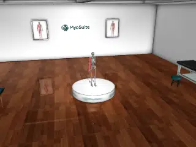
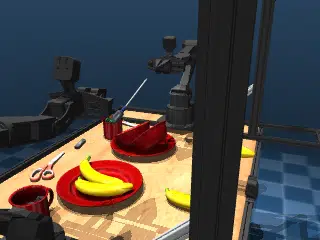
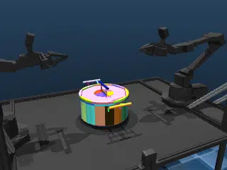
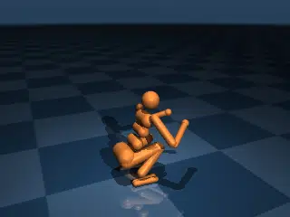
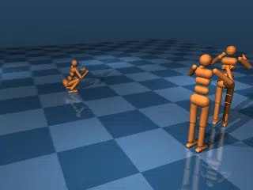
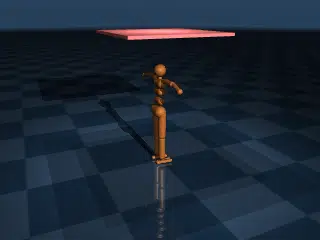

[](https://github.com/google-deepmind/mujoco_warp/actions/workflows/ci.yml?query=branch%3Amain)
[](https://mujoco.readthedocs.io/en/latest/mjwarp/index.html)
[](https://github.com/google-deepmind/mujoco_warp/blob/main/LICENSE)
[](https://google-deepmind.github.io/mujoco_warp/nightly/)

# MuJoCo Warp (MJWarp)

MJWarp is a GPU-accelerated version of the [MuJoCo](https://github.com/google-deepmind/mujoco) physics simulator, designed for NVIDIA hardware. MJWarp delivers high-throughput, accurate simulation for robotics research.

MJWarp is maintained by [Google DeepMind](https://deepmind.google/) and [NVIDIA](https://www.nvidia.com/) as part of the [Newton](https://github.com/newton-physics/newton) project.

# Getting started

MuJoCo Warp requires an NVIDIA GPU for fast simulation but supports CPU for development and debugging.

**Try it now:** view a simulation of a dancing humanoid robot locally on your machine:

```bash
git clone https://github.com/google-deepmind/mujoco_warp.git && cd mujoco_warp
python benchmarks/run.py -f unitree_g1_flat --view
```

Or try out [a tutorial in your browser](https://colab.research.google.com/github/google-deepmind/mujoco_warp/blob/main/notebooks/tutorial.ipynb) (no local setup required).

MJWarp is also available via PyPI:

```bash
pip install mujoco-warp
```

# Examples

MuJoCo Warp simulates many kinds of physical systems, from rigid bodies with contacts to soft bodies, cloth, signed distance fields, and more. Here are a few examples of what it can do:

<table>
  <tr>
    <td align="center" width="33%">
      
      <br><b>python benchmarks/run.py -f unitree_g1_flat --view</b>
    </td>
    <td align="center" width="33%">
      
      <br><b>python benchmarks/run.py -f unitree_g1_hfield --view</b>
    </td>
    <td align="center" width="33%">
      
      <br><b>python benchmarks/run.py -f myoarm --view</b>
    </td>
  </tr>
  <tr>
    <td align="center" width="33%">
      
      <br><b>python benchmarks/run.py -f aloha_clutter --view</b>
    </td>
    <td align="center" width="33%">
      
      <br><b>python benchmarks/run.py -f aloha_pot --view</b>
    </td>
    <td align="center" width="33%">
      
      <br><b>python benchmarks/run.py -f aloha_sdf --view</b>
    </td>
  </tr>
  <tr>
    <td align="center" width="33%">
      
      <br><b>python benchmarks/run.py -f humanoid --view</b>
    </td>
    <td align="center" width="33%">
      
      <br><b>python benchmarks/run.py -f three_humanoids --view</b>
    </td>
    <td align="center" width="33%">
      
      <br><b>python benchmarks/run.py -f cloth --view</b>
    </td>
  </tr>
</table>

Each of these scenes is benchmarked nightly and the [results are published nightly](https://google-deepmind.github.io/mujoco_warp/nightly/).

# Tips for developers

To set up MJWarp for development:

```bash
git clone https://github.com/google-deepmind/mujoco_warp.git && cd mujoco_warp
uv sync --all-extras  # install all optional dependencies for development
uv run pre-commit install  # enables ruff, uv-lock, and kernel-analyzer checks on commit
uv run pytest -n 8  # run all tests, verify everything works
```

If you plan to write Warp kernels for MJWarp, please use the `kernel_analyzer` vscode plugin located in [`contrib/kernel_analyzer`](https://github.com/google-deepmind/mujoco_warp/tree/main/contrib/kernel_analyzer).
See the [README](https://github.com/google-deepmind/mujoco_warp/blob/main/contrib/kernel_analyzer/README.md) there for details on how to install it and use it.  The same kernel analyzer will run on any PR
you open, so it's important to fix any issues it reports.

For performance profiling MJWarp, use the `--event_trace` flag on `mjwarp-testspeed` to get a full trace on a test scene of your choice:

```bash
mjwarp-testspeed benchmarks/humanoid/humanoid.xml --event_trace
```

`mjwarp-testspeed` has many configuration options, see ```mjwarp-testspeed --help``` for details.  For more details and advanced topics on using MJWarp, see the [MuJoCo Warp documentation](https://mujoco.readthedocs.io/en/latest/mjwarp/index.html).

# Running on AMD / ROCm

This fork targets AMD Instinct GPUs (e.g. MI300X / MI350 / MI355X, `gfx94x`/`gfx95x`) via the ROCm fork of Warp. MJWarp itself is backend-agnostic, but it relies on Warp for kernel compilation and execution, and the upstream `warp-lang` wheels on PyPI are CUDA-only. For this reason MJWarp does **not** declare `warp-lang` as a dependency: on ROCm you build and install Warp from source first, and then install MJWarp against that build.

1. Build and install the ROCm fork of Warp from source (this produces the native `warp.so` for your ROCm install):

```bash
git clone --branch amd-integration https://github.com/ROCm/warp.git && cd warp
python build_lib.py        # compiles the native Warp library against your ROCm toolchain
pip install -e .           # installs warp-lang (e.g. 1.x+rocm) in editable mode
```

2. Install MJWarp into the same environment without disturbing your source-built Warp:

```bash
git clone https://github.com/ROCm/mujoco_warp.git && cd mujoco_warp
pip install -e . --no-deps                       # MJWarp itself (won't touch Warp)
pip install absl-py "etils[epath]" "mujoco>=3.8.0" numpy   # runtime deps
```

3. Verify Warp sees your AMD GPUs and run the tests:

```python
import warp as wp
print(wp.get_devices())  # should list your AMD GPUs as cuda:N
```

```bash
pip install pytest pytest-xdist
pytest mujoco_warp -n 8
```

Some Warp features are not yet available on the HIP/ROCm backend, and the corresponding tests are skipped automatically based on the active device's capabilities (`device.supports_graph_capture`, `device.supports_cubql`, and texture support). These cover native CUDA graph capture, the cuBQL BVH builder, and CUDA textures (used by the GPU batch renderer).

Avoid `uv sync` on ROCm: it provisions an isolated environment and would not pick up your source-built Warp. Use the source build above instead.

# Integrating MuJoCo Warp

There are many ways to use MuJoCo Warp in your projects. In many cases, you can directly install and use MJWarp as a drop-in replacement for MuJoCo.

If you prefer the [JAX](https://github.com/jax-ml/jax) ecosystem, you can use MJWarp via [MJX](https://mujoco.readthedocs.io/en/stable/mjx.html).  See [MuJoCo Playground](https://github.com/google-deepmind/mujoco_playground) for robotics machine learning recipes that use [JAX](https://github.com/jax-ml/jax) and MJWarp.

If you prefer [PyTorch](https://pytorch.org/) for research, consider one of these two great options:

* [Isaac Lab](https://github.com/isaac-sim/IsaacLab/tree/feature/newton) integrates MJWarp via [Newton](https://github.com/newton-physics/newton).  This setup enables powerful, highly extensible multi-physics simulation with deep NVIDIA ecosystem integration.
* [mjlab](https://github.com/mujocolab/mjlab) exposes the [Isaac Lab](https://github.com/isaac-sim/IsaacLab) manager-based API directly on top of MJWarp, providing a focused framework for robotics research with minimal dependencies and direct access to native MuJoCo data structures.

# MuJoCo API Compatibility

MuJoCo Warp supports the same features as MuJoCo with the following exceptions:

- **Integrator**: `IMPLICITFAST` midpoint integrator feature is not supported
- **Solver**: `PGS` and `noslip` not yet supported
- **Actuator / Sensors**: `PLUGIN` types not yet supported
- **Flex**: experimental — not all features are implemented or optimized yet

[Differentiability via Warp](https://nvidia.github.io/warp/user_guide/differentiability.html) is not yet available. See [#500](https://github.com/google-deepmind/mujoco_warp/issues/500) for progress.

# Batch Rendering

MJWarp includes a **high-throughput** GPU batch renderer designed for simultaneous rendering of cameras across many parallel simulation worlds. The renderer uses ray-tracing to render MuJoCo scenes at millions of frames per second on NVIDIA GPUs.

Key capabilities:
- Mesh rendering
- Texture support
- Heightfield rendering
- Flex deformable rendering
- Heterogeneous multi-camera support (different resolutions/FOV/intrinsics for each camera)
- Lighting and shadow support

See the [announcement PR](https://github.com/google-deepmind/mujoco_warp/pull/1113) for more details.

# License

MJWarp is released under the Apache 2.0 license. See [LICENSE](LICENSE) for details.