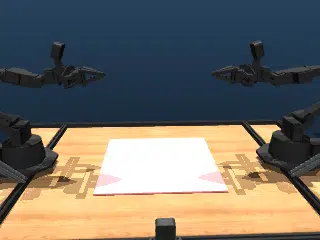

# Aloha Cloth

## Description

[ALOHA 2](https://aloha-2.github.io/) robot with cloth on a work table.  This benchmark exercises [MuJoCo deformable bodies](https://mujoco.readthedocs.io/en/stable/modeling.html#deformable-objects) in a workbench setting with many DoFs.

### aloha_cloth

| Property | Value |
|----------|-------|
| Bodies | 921 |
| DoFs | 2716 |
| Actuators | 14 |
| Geoms | 95 |
| Timestep | 0.002s |
| Solver | CG |
| Friction | Pyramidal |
| Integrator | Euler |
| Matrix Format | Sparse |

