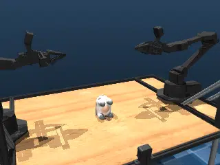

# Aloha SDF

## Description

[ALOHA 2](https://aloha-2.github.io/) robot with an SDF cow on the table.  This benchmark exercises [SDF](https://en.wikipedia.org/wiki/Signed_distance_function) queries in a simple, single-object manipulation scenario.

### aloha_sdf

| Property | Value |
|----------|-------|
| Bodies | 22 |
| DoFs | 22 |
| Actuators | 14 |
| Geoms | 96 |
| Timestep | 0.002s |
| Solver | Newton |
| Friction | Elliptic |
| Integrator | Euler |
| Matrix Format | Dense |

