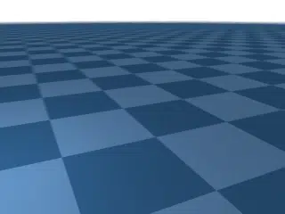
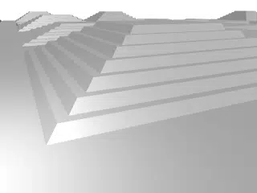
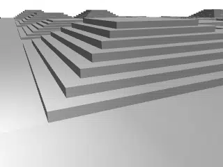

# Apptronik Apollo

## Description

Humanoid locomotion benchmarks using the [Apptronik Apollo](https://apptronik.com/apollo).

### apptronik_apollo_flat

Standing on flat ground.

| Property | Value |
|----------|-------|
| Bodies | 37 |
| DoFs | 25 |
| Actuators | 19 |
| Geoms | 19 |
| Timestep | 0.005s |
| Solver | Newton |
| Friction | Pyramidal |
| Integrator | Euler |
| Matrix Format | Dense |

### apptronik_apollo_hfield

Standing on a heightfield.

| Property | Value |
|----------|-------|
| Bodies | 37 |
| DoFs | 25 |
| Actuators | 19 |
| Geoms | 19 |
| Timestep | 0.005s |
| Solver | Newton |
| Friction | Pyramidal |
| Integrator | Euler |
| Matrix Format | Dense |

### apptronik_apollo_terrain

Standing on a terrain with pyramids made of box geometries.  Excersises broad phase collision detection.

| Property | Value |
|----------|-------|
| Bodies | 37 |
| DoFs | 25 |
| Actuators | 19 |
| Geoms | 5290 |
| Timestep | 0.005s |
| Solver | Newton |
| Friction | Pyramidal |
| Integrator | Euler |
| Matrix Format | Dense |

