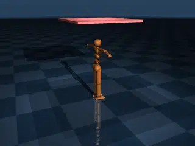

# Cloth

## Description

A soft-body simulation benchmark featuring a cloth draped over the MuJoCo humanoid. This tests the performance of [MuJoCo deformable bodies](https://mujoco.readthedocs.io/en/stable/modeling.html#deformable-objects).

### cloth

| Property | Value |
|----------|-------|
| Bodies | 918 |
| DoFs | 2706 |
| Actuators | 0 |
| Geoms | 21 |
| Timestep | 0.005s |
| Solver | CG |
| Friction | Pyramidal |
| Integrator | Euler |
| Matrix Format | Sparse |

