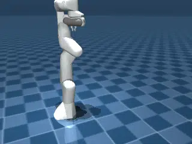

# Franka Emika Panda

## Description

Measures how quickly MuJoCo Warp can simulate nothing useful happening.

### franka_emika_panda

| Property | Value |
|----------|-------|
| Bodies | 12 |
| DoFs | 9 |
| Actuators | 8 |
| Geoms | 23 |
| Timestep | 0.005s |
| Solver | Newton |
| Friction | Pyramidal |
| Integrator | ImplicitFast |
| Matrix Format | Dense |

