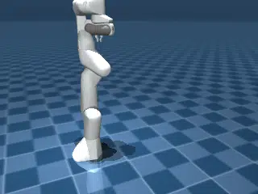

# Franka Emika Panda

## Description

Measures MuJoCo Warp throughput for the Panda in idle and continuous assembly scenes.

### franka_emika_panda

| Property | Value |
|----------|-------|
| Bodies | 12 |
| DoFs | 9 |
| Actuators | 8 |
| Geoms | 23 |
| Timestep | 0.005s |
| Solver | Newton |
| Friction | Pyramidal |
| Integrator | ImplicitFast |
| Matrix Format | Dense |



### panda_nist_assembly

A Panda threads an M8 nut onto a bolt on the NIST board. The scene also contains
an RJ45 connector, large gear and 8 mm rod, already assembled at this point in
the recorded episode. It uses one ground plane, native SDF collision for the
assembly parts, and Panda visuals from the pinned Menagerie assets. Offline
preparation builds depth-8 SDFs into an MJB outside the source package.
Asset hosting is pending. The nine NIST meshes and their license notices need
to be uploaded to a MuJoCo-owned repository before a source revision can be pinned
here. This benchmark cannot run from a clean checkout until that upload is complete.

The replay starts with the nut partly threaded and contains one initial
position/velocity state followed by 300 policy-recorded actuator targets at 10 ms
intervals. The standard loader holds each target for eight 1.25 ms physics steps.
Timing covers all 2,400 steps (three simulated seconds), with 4,096 parallel worlds.
There is no policy inference, per-step state restoration, or episode-reset logic.

Once the upstream asset source is added:

```bash
CUDA_VISIBLE_DEVICES=1 uv run python benchmarks/run.py -f '^panda_nist_assembly$' --clear_warp_cache false
CUDA_VISIBLE_DEVICES=1 uv run python benchmarks/run.py -f '^panda_nist_assembly$' --view
```

The validation and timings in the provenance file were recorded before the rebase,
using MuJoCo 3.12.1.dev968306640, Warp 1.15.0 and the engine revision recorded there.
They are historical results, not measurements of current main.

Replay and asset hashes are recorded in [nist_k4_provenance.json](nist_k4_provenance.json).
The prepared asset upload includes the source attribution, Factory BSD-3-Clause
license and acknowledgments. Runtime assets must come from a MuJoCo-owned repository.
