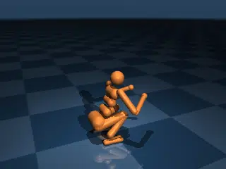
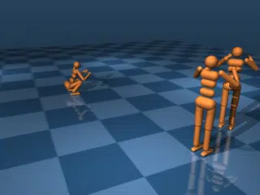

# Humanoid

## Description

No benchmark suite is complete without the [classic MuJoCo humanoid](https://www.youtube.com/watch?v=EI3gcbDUNiM&t=262s)!  This is our "hello world" benchmark that we run to ensure the core algorithms are performant, sound, and we have no regressions.

### humanoid

A single humanoid on flat ground instantiated in a crouching position.

| Property | Value |
|----------|-------|
| Bodies | 17 |
| DoFs | 27 |
| Actuators | 21 |
| Geoms | 20 |
| Timestep | 0.005s |
| Solver | Newton |
| Friction | Pyramidal |
| Integrator | Euler |
| Matrix Format | Dense |

### three_humanoids

Three humanoids on flat ground.  This tests performance at the cross-over point between dense and sparse matrix solvers.

| Property | Value |
|----------|-------|
| Bodies | 49 |
| DoFs | 81 |
| Actuators | 63 |
| Geoms | 58 |
| Timestep | 0.005s |
| Solver | Newton |
| Friction | Pyramidal |
| Integrator | Euler |
| Matrix Format | Sparse |

